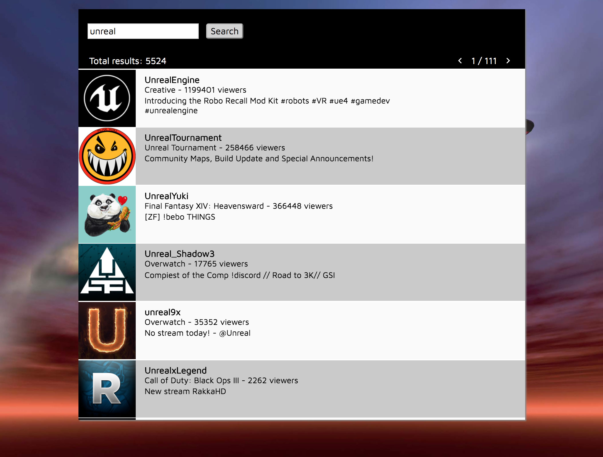

# TwUnr (Twitch 'Tuner')
Skeleton demo for demo app that shows Twitch channels in a similar way to radio stations.  (Vanilla JS)

Ensure that you specify your Twitch Client ID inside bundle/js/script.js on line 4.

### Preview:

[Demo link](http://myidata.com/demos/TwUnr/)
